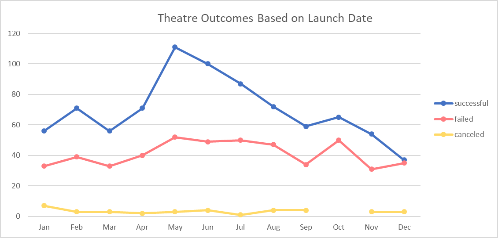
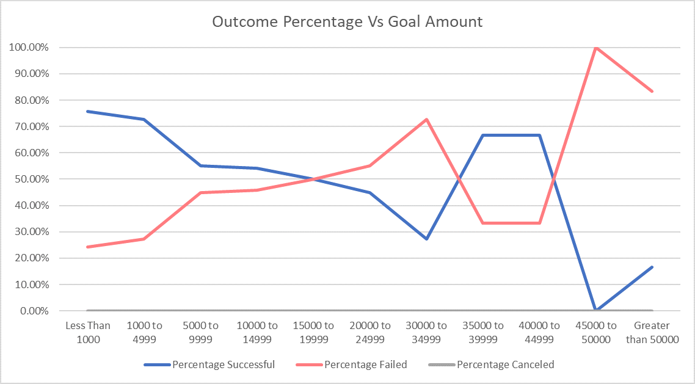

# Kickstarting with Excel

## Overview of Project

  As a way to practice the skills learned in the Microsoft Excel Module, I have been asked to pretend that my friend, Louise, has created a Kickstarter Campaign for her play, Fever. As her play quickly reached it's Kickstarter campaign goal, she became curious how campaigns similar to her own fared. Focusing mostly on the start date of the campaign and the funding goals set, I have analyzed Kickstarter data to provide some insight to my friend.

### Purpose

  I combed through a large dataset of every Kickstarter campaign ever created using filters, pivot tables/charts, VLookUp, and formulas to create summary statistics. I have also applied conditional formatting to the data set, converted a UNEX code into a readable date, and created multiple pages of results from queries about the dataset.

## Analysis and Challenges

### Analysis of Outcomes Based on Launch Date

  The line graph above shows the results of our research on how the launch date of a theatre campaign effects the outcome of that campaign.
 
  Even though the variance between successful campaigns and failed campaigns varies throughout the year, there are more successful theatre campaigns than failed ones in any given month. December has the worse success rate and lowest total successes of any month, while May has the highest total successes and the best success rate. Outside May and December, the ouctomes follow a similar trajectory, and the success rate doesn't change wildly. 

### Analysis of Outcomes Based on Goals

  This line graph presents how the goal amount affects the outcome percentage of a play campaign. 
  As to be expected, a Kickstarter campaign is most likely to succeed when the goal amount is set low. However, from $30,000 to $45,000, we see a strange increase in the success rate. While the sample size is smaller for Kickstarter campaigns with goals this high, one would still assume that these campaigns would be failing more often than succeeding.
  
  No Kickstarter campaign for a play with a goal price between $45,000 and $49,999 has ever succeeded. This doesn't seem outlandish as an isolated fact, as that sounds like a steep price for a play. However, when seen next to the fact that there have been successes in goal amounts higher than $50,000, it does raise some questions about percieved quality and price point.
  
  
### Challenges and Difficulties Encountered

  For the most part, this challenge went without any real difficulties for me. However, I can see how some small challenges in the module could have caused problems for beginners. Correctly setting up pivot tables can be tricky at first. Formatting the charts correctly and saving them as a png could also pose difficulty. 
  For me, the biggest challenge faced was learning to format in Markdown, and using GitHub in general. 
  
  
## Results

#### What are two conclusions you can draw about the Outcomes based on Launch Date?

- Kickstarter campaigns for theatre are most successful when started during the summer, peaking in May.

- Kickstarter campaigns for theatre fail almost as frequently as they succeed when starting in December. This is the only month where this is the case. While the graph cannot tell us WHY this is true, I speculate that during the month of December, people are less willing to donate to a Kickstarter for theatre as they are likely saving for holliday gifts or donating their money to a "better" cause.

#### What can you conclude about the Outcomes based on Goals?

- The lower that the goal for a Theatre Kickstarter Campaign is, the more likely it is to succeed... except for between $35,000 to $45,000. This spike in success rate, while interesting, does not make much sense and is likely caused by a small sample size.  

#### What are some limitations of this dataset?

  Because Louise was mostly concerned with theatre and plays, we miss out on a large portion of the original dataset. The analysis performed and conclusions created probably don't match what we would find in other categories. The Kickstarter data is also not fully up to date, and results from more recent campaigns could alter the findings. 
  
  
#### What are some other possible tables and/or graphs that we could create?
  Depending on what Louise was curious about, there are tons of different tables and graphs that could be made from this dataset. The following list are ideas for graphs that I think may have had interesting results:
  
- We could have created a new field based on the date created and date finished, and seen how the duration of a campaign is related to its outcome
- How does the success rate of theatre campaigns compare to the success rate of other subcategories?
- How does the average donation amount relate to the success rate of campaigns, and does this differ in different categories of campaigns?
- Overall, has the success rate of Kickstarter campaigns improved or gotten worse through the years of its existence?
- Does the country of origin affect the campaign's success?

